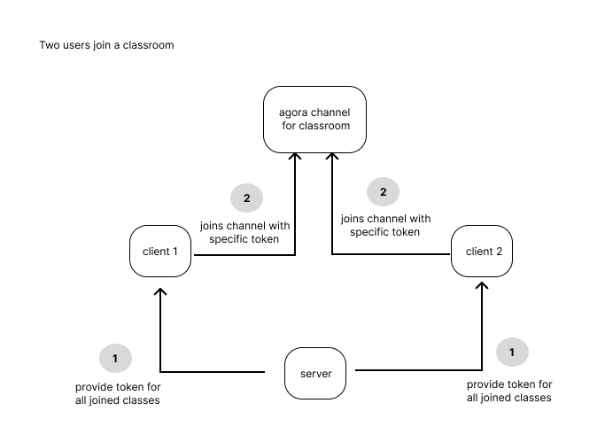
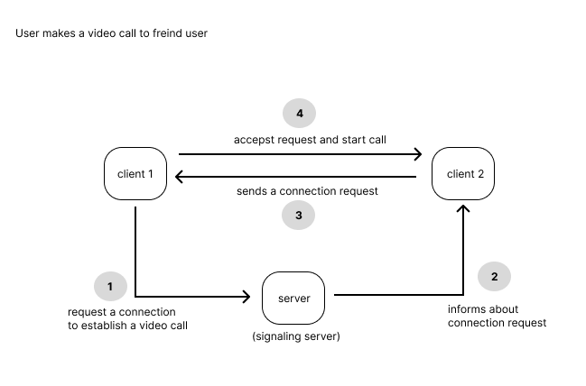
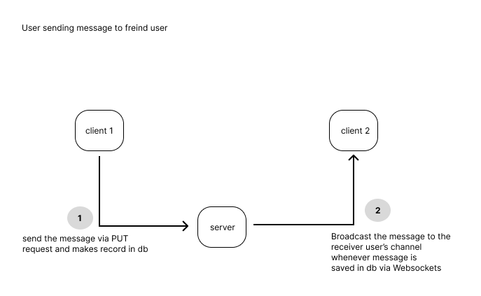

# Project Panthiya: Acknowledgemernts & Report

## **Acknowledgements**

A special thanks to everyone who contributed to this project. Your support and insights were invaluable.

---

## **Distinctiveness and Complexity**

### **1.1 Problem Statement**

Sri Lanka is a tropical island country located in the middle of the Indian Ocean. Education was made free on October 1, 1945, by Dr. C.W.W. Kannangara, and this policy has had a great impact on improving the country's capabilities across all fronts to achieve greater heights. With the introduction of an open trade policy, a number of events that have impacted the country and the government over the years have affected the government's ability to provide free education to every citizen. This has led to an issue where students from rural areas have very little opportunity to access educational materials compared to students from urban areas who have access to the internet, private tuition classes, and educated mentors from the community. Ultimately, most of the children finish attending school and their education process at the average age of 16 years.

### **1.2 Project Objectives**

This project aims to create an online education platform that can be easily accessible by any student who has access to a working smart mobile device with minimum hardware capabilities.

### **1.3 Requirement Specification**

A sample of students from different geographical areas and a sample of students from urban areas that could benefit from the initiative were consulted prior to detailing the requirement specification to ensure project sustainability and to build the most practical solution to overcome the identified problem.

#### **Identified Core Functional Requirements:**

- Users should be able to log in and verify their identity to create a safe environment for every user.
- Users should be able to create classrooms and make them available for every user.
- Users should be able to join any class made by any user.
- Users should be able to join a classroom at any time outside of the specified class schedule to share their ideas and get assistance from other classmates.
- Users should be able to contact other users within the platform to build lasting relationships and get assistance to complete their academical endeavors.

#### **Identified Core Non-Functional Requirements:**

1.  The baseline support of the application should be the most used mobile and computer operating systems, starting from the oldest version.
2.  The user interface should be simple and focused on the core functionality of the system.
3.  Each feature should be designed modularly to avoid unnecessary distraction and to foster a strong learning environment.
4.  Users should be able to access every feature with three button clicks.
5.  The application should execute minimum client-side code to support operating systems with less memory capabilities.
6.  The application should have maximum cache control to reduce data usage on all devices.
7.  The application should focus its objective as an education platform rather than a resource material sharing or resource material storing platform.
8.  The application should securely store user data and should not use users' data for any internal or external procedure without the user’s consent.

### **1.4 Conclusion**

Project Panthiya is an initiative to address an ongoing social issue in a specific demographic area and delivers a foundational codebase that could improve over the years to foster free education in the given demographic area. The Agora video calling platform and WebRTC technology have been utilized throughout this project to develop the core features of the proposed system. Each technological decision that was taken is outlined in the following section with the factors that were taken into account, in regards to those decisions such as technical complexity and the nature of the target audience.

---

### **2.1 File Structure**

Specific files that were changed or introduced are detailed in the following section.

-   **`Panthiya`**: Main directory for the project.
    -   **`agoraClassroomTokenBuilder`**: Implements the specific algorithm provided by the Agora platform to generate valid tokens to use their services.
    -   **`Classsroom`**: This is the project package which contains configurations for the complete project.
        -   `asgi.py`: Configurations for the ASGI server.
        -   `settings.py`: New configurations were added to configure CSRF trusted origins, REST framework configurations, templates, channels layers, and static and media directories.
        -   `urls.py`: Default signup, password\_reset, and logout features were enabled.
    -   **`Media`**: Contains classroom thumbnail, profile, and layout images for the development environment.
    -   **`Templates`**: Contains Django template files that are used for user login and registration.
    -   **`Videochat`**: This directory contains most of the source code for core functionalities apart from the boilerplate code provided by the Django framework.
        -   **`Consumers`**: Contains the definition of WebSocket consumer classes for the message and notification WebSocket implementations.
        -   **`Static`**: Contains JavaScript and CSS files used for all the pages.
        -   **`videochat/Templates`**: Contains HTML files used for all the pages.
        -   **`videochat/apps.py`**: Sets the default type for primary keys in all models in the video chat app as `BigAutoFields`.
        -   **`ws_urls.py`**: Uses consumer classes defined in `consumers.py` and exposes them to `asgi.py` to implement WebSockets.

### **2.2 New files added to initial django setup**
* `agoraClassroomTokenBuilder`
* `Videochat`
* `ws_urls.py`

### **2.3 Explanation of Technologies Selected**

The following technical decisions were taken to ensure the final application is capable of delivering a rich user experience while being accessible from any device with minimum capabilities.

-   All the pages except the chat page are served to the user using Django template files, including the navigation sidebar. Components in every section are designed in a way that redundant HTML that needs to be loaded on the client device will be cached, leading to very little data being rerendered on the interface with every user interaction.

-   The Agora SDK is used to provide classroom functionality, given the complexity of implementing a server capable of combining multiple user streams and distributing them, which can lead to an increased payload on users' devices.

-   Video call and chat functionality is implemented using WebRTC to embrace the modular design and custom functionalities provided by WebRTC.

-   Each user is required to log in to use the application to ensure the security of the users and the platform.

### **2.4 Security Flows**

#### **High-Level Design:**

-   **Classroom Feature**
  
-   **Video Call Feature**

-   **Chat Feature**

---

### **3.1 Setting up Development Environment**

#### **Prerequisites**
* Redis

### **3.2 In Docker Environment**

1.  Go to the root directory where this project is stored and use the following command to build a Docker image using the Dockerfile.
    ```bash
    docker build -t panthiya .
    ```

2.  Run the Docker container using the generated image and go into the shell inside the Docker container while mirroring the changes you made to the codebase. (When you make a change to your codebase from the host environment, it will be reflected in the application running inside the Docker container).
    ```bash
    docker run --rm -it -p 8000:8000 -v "C:/_projects/panthiya/panthiya:/app" -w /app panthiya:latest /bin/sh
    ```

3.  Now run the `start.sh` file to start the Redis server and Django server (make sure the `start.sh` file uses the LF end-of-line convention by opening the file in VS Code and checking the file type; if not, it can be changed using VS Code).
    ```bash
    ./start.sh
    ```

### **3.3 In Linux Environment**

1.  Configure the Redis server for Django Channels by replacing `"your-very-strong-and-secret-password"` with your password for the channel layers config in `classroom/settings.py`.

2.  Install and run `redis-server` using the following command. Replace the password you used with the following password.
    ```bash
    redis-server --requirepass "<password>"
    ```

3.  This project requires Python 3.10. Use a Python environment manager to ensure the correct Python version is installed. The following command can be used to create a Python environment using `pipenv`.
    ```bash
    pipenv --python 3.10
    ```

4.  Activate the environment.
    ```bash
    pipenv shell
    ```

5.  Install all the required packages.
    ```bash
    pip install -r requirements.txt
    ```

6.  Generate static files.
    ```bash
    python manage.py collectstatic --noinput
    ```

7.  Run the Django development server.
    ```bash
    python manage.py runserver
    ```
    If the Python version is correct and the application can successfully communicate with the `redis-server`, Django will start a development server that supports WebSockets and will display that the ASGI server has been started.

### **3.4 In Windows Environment**

1.  Install WSL2 and install Redis inside WSL.

2.  Open the Redis config file using a text editor to bind Redis to localhost inside WSL.
    ```bash
    sudo vim /etc/redis/redis.conf
    ```

3.  Locate the `bind` directive and change it to:
    ```
    bind 0.0.0.0
    ```

4.  Restart the Redis server.
    ```bash
    sudo service redis-server restart
    ```

5.  Now, ensure the Django project is configured to use the Redis server by changing this line in `classroom/settings.py`:
    ```python
    'hosts': ['redis://:your-very-strong-and-secret-password@localhost:6379'],
    ```
    to this:
    ```python
    "hosts": [("127.0.0.1", 6379)],
    ```

6.  Start the Django development server.
    ```bash
    python manage.py runserver
    ```


Current SuperUser Name: wishwa
password:1234